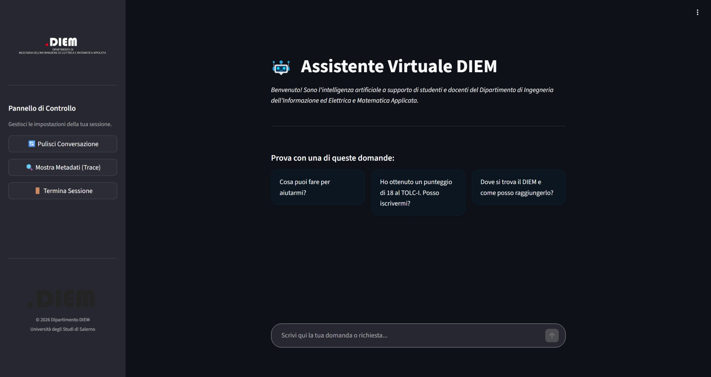

#  DIEM Chatbot  -  LLM-Powered Virtual Assistant

<p align="center">
  <a href="https://www.diem.unisa.it/">
    
  </a>
</p>

<p align="center">
  <strong>An intelligent RAG-based conversational assistant for the Department of Information Engineering, Electrical Engineering and Applied Mathematics (DIEM) at the University of Salerno.</strong>
</p>

<p align="center">
  
  
  
  
  
</p>

---

## 📖 Overview

The **DIEM Chatbot** is a production-grade, Retrieval-Augmented Generation (RAG) system designed to serve students, faculty, and external visitors of the DIEM department. It answers natural-language questions by retrieving grounded information from the department's official web sources — eliminating the need to manually navigate dozens of web pages.

The system is built around an **agentic LLM pipeline** with four specialized search tools, a smart conversational memory, multilingual support, and multiple safety layers including scope-aware guardrails.

---

## 🖥️ Interface Preview

<div align="center">
  
</div>

## ✨ Key Features

- **Agentic RAG with Parallel Tool Calling** — The LLM autonomously decides which knowledge collections to query and fires multiple tool calls in a single turn when needed
- **Multi-Collection Knowledge Base** — Documents are organized into three Chroma vector store collections: `persone` (faculty), `offerta_formativa` (degree programs), and `dipartimento` (department info)
- **Incremental Web Crawling** — A multi-threaded BFS crawler automatically scrapes and indexes HTML pages and PDFs from the DIEM ecosystem (`diem.unisa.it`, `docenti.unisa.it`, `corsi.unisa.it`)
- **Smart Conversational Memory** — Semantic similarity filtering and automatic summarization keep conversation context relevant without overloading the context window
- **Query Optimization** — Coreference resolution rewrites ambiguous follow-up questions, and multi-query expansion improves retrieval recall
- **Cross-Encoder Reranking** — A dedicated CrossEncoder model reranks retrieved candidates before passing them to the LLM
- **Guardrails** — Input/output safety checks (injection, toxicity, PII, hallucination, code generation) via a dedicated Groq LLM, with scope-awareness to handle out-of-domain questions
- **Meta-Query Handling** — Greetings, thanks, and identity questions are handled without knowledge retrieval and without polluting conversation memory
- **Automatic Fallback** — If a specialized collection returns no results, an internal `search_all` cross-collection fallback activates transparently
- **RAGAS Evaluation** — A fully automated evaluation pipeline with a robust Judge LLM (retry + JSON-repair) and export to JSON/CSV/Excel
- **Multilingual** — Tool queries are always sent in Italian (for retrieval accuracy); responses are generated in the user's language
- **Streamlit Web UI** — A polished chat interface with trace inspection, session management, and suggested starter questions

---

## 📁 Project Structure

```
.
├── src/
│   ├── app.py                    # Streamlit web application entry point
│   ├── agent/
│   │   ├── agent.py              # RAGAgent facade and RAGAgentFactory
│   │   ├── agent_main.py         # CLI entry point and REPL
│   │   ├── callbacks.py          # Observability and interaction logging
│   │   ├── guardrails.py         # Input/output safety checks
│   │   ├── guardrails_config/    # NeMo Guardrails prompts and rail definitions
│   │   ├── llm_providers.py      # LLM provider abstraction (Ollama/Groq/HuggingFace)
│   │   ├── memory.py             # SmartConversationMemory with semantic filtering
│   │   ├── prompts.py            # System prompts (agent + meta queries)
│   │   └── tools/                # LangChain tools (search_persone, search_offerta_formativa, etc.)
│   ├── config/
│   │   ├── settings.py           # Centralized configuration (dataclasses + env vars)
│   │   └── logging_config.py     # Logging setup
│   ├── evaluation/
│   │   ├── config.py             # Evaluation configuration
│   │   ├── dataset.py            # Dataset builder (loads questions, runs agent, builds RAGAS dataset)
│   │   ├── eval_main.py          # CLI entry point for evaluation
│   │   ├── judge.py              # Robust Judge LLM (retry + JSON-repair)
│   │   └── runner.py             # Evaluation orchestrator (RAGAS metrics + report export)
│   ├── ingestion/
│   │   ├── indexer.py            # Multi-collection chunking, embedding, and Chroma indexing
│   │   ├── registry.py           # Incremental indexing registry (SHA-256 based)
│   │   ├── router.py             # Document routing and metadata extraction
│   │   └── scheduler_main.py     # Ingestion pipeline CLI (scrape / index / verify / full)
│   ├── retrieval/
│   │   └── engine.py             # QueryOptimizer, CrossEncoderReranker, RetrievalEngine
│   └── scraping/
│       ├── factories.py          # HTML and PDF rule factories
│       ├── interfaces.py         # Abstract base classes (CleaningRule, PdfFilterRule, UrlClassifier)
│       ├── persistence.py        # HTML document and PDF ledger persistence
│       ├── scrapers.py           # Multi-threaded BFS crawler (UnisaCrawler)
│       └── rules/                # Concrete rule implementations (HTML content, PDF, URL classifiers)
└── data/
    ├── raw/                      # Crawled HTML files and PDF links
    ├── vectorstore/              # ChromaDB persistence and parent docstore
    └── evaluation/               # Evaluation question sets (JSON)
```

---

## 🛠️ Tech Stack

| Component | Technology |
|---|---|
| LLM Backend | Ollama (Nemotron, Qwen), Groq (Llama 3.3 70B), HuggingFace |
| Agent Framework | LangChain (create_agent, tool calling) |
| Vector Store | ChromaDB |
| Embeddings | `Qwen3-Embedding-0.6B` |
| Reranker | `Qwen3-Reranker-0.6B` |
| Web Crawling | AsyncHtmlLoader, BeautifulSoup4, Requests |
| Web UI | Streamlit |
| Guardrails | Groq (Llama 3.3 70B) with custom prompt-based rails |
| Evaluation | RAGAS framework |
| Configuration | Environment variables + Python dataclasses |

---

## 🚀 Getting Started

### Prerequisites

- Python 3.10+
- [Ollama](https://ollama.com/) running locally (or valid Groq API keys)
- ChromaDB dependencies

### Installation

```bash
# Clone the repository
git clone <repo-url>
cd <repo-directory>
```

### Configuration

Create a `.env` file in the project root:

```env
# LLM Provider (ollama | groq | huggingface)
LLM_PROVIDER=ollama
LLM_MODEL=nemotron-3-super:cloud
OLLAMA_BASE_URL=http://localhost:11434

# Groq API Keys (optional, for guardrails and/or chat)
GROQ_CHAT_API_KEY=your_key_here
GROQ_REWRITER_API_KEY=your_key_here
GROQ_GUARDRAILS_API_KEY=your_key_here

# Embedding Model
EMBEDDING_MODEL=Qwen/Qwen3-Embedding-0.6B
RERANKER_MODEL=Qwen/Qwen3-Reranker-0.6B

# Vector Store
CHROMA_PERSIST_DIR=data/vectorstore/chroma
```

### 1. Build the Knowledge Base

```bash
# Full pipeline: crawl the DIEM website and index everything
python -m ingestion.scheduler_main --mode full

# Or run steps individually:
python -m ingestion.scheduler_main --mode scrape   # crawling only
python -m ingestion.scheduler_main --mode index    # indexing only
python -m ingestion.scheduler_main --mode verify   # verify collections
```

### 2. Launch the Web UI

```bash
cd src
python -m streamlit run app.py
```

### 3. Use the CLI (Interactive REPL)

```bash
cd src
python -m agent.agent_main

# Single query mode
python -m agent.agent_main --single-query "What degree programs does DIEM offer?"

# Disable scope guardrail (for testing)
python -m agent.agent_main --no-scope-guard
```

---

## 📊 Evaluation

The project includes a full automated evaluation pipeline using the [RAGAS](https://github.com/explodinggradients/ragas) framework.

### Prepare a Question Set

Create `data/evaluation/questions.json`:

```json
{
  "dataset_name": "DIEM Evaluation Set",
  "samples": [
    {
      "question": "What degree programs are offered by DIEM?",
      "ground_truth": "DIEM offers degree programs in..."
    }
  ]
}
```

### Run Evaluation

```bash
cd src
python -m evaluation.eval_main --input data/evaluation/questions.json

# Options:
# --output results/run_01     # custom output directory
# --no-guardrails             # disable guardrails during evaluation
# --log-level DEBUG           # verbose logging
```

The runner produces a timestamped JSON report, CSV, and a styled Excel workbook with per-sample metrics and aggregated scores for: **Context Precision**, **Context Recall**, **Response Relevancy**, **Faithfulness**, and **Factual Correctness**.

---

## ⚙️ Configuration Reference

All settings are managed via environment variables or Python dataclasses in `src/config/settings.py`. Key parameters:

| Variable | Default | Description |
|---|---|---|
| `LLM_PROVIDER` | `ollama` | LLM backend (`ollama`, `groq`, `huggingface`) |
| `LLM_MODEL` | `nemotron-3-super:cloud` | Model name |
| `LLM_TEMPERATURE` | `0.0` | Generation temperature |
| `EMBEDDING_MODEL` | `Qwen/Qwen3-Embedding-0.6B3` | HuggingFace embedding model |
| `RERANKER_MODEL` | `Qwen/Qwen3-Reranker-0.6B` | CrossEncoder reranker |
| `RERANKER_TOP_N` | `5` | Number of documents after reranking |
| `MEMORY_MAX_TURNS` | `10` | Max conversation turns to retain |
| `MEMORY_SIMILARITY_THRESHOLD` | `0.55` | Cosine similarity cutoff for memory filtering |
| `MAX_TOOL_CALLS` | `3` | Max tool invocations per agent turn |
| `MAX_DEPTH` | `5` | Crawler BFS depth |

---

## 🛡️ Guardrails

The system implements a three-stage safety pipeline powered by Llama 3.3 70B via Groq:

1. **Input Check** — Blocks prompt injections, toxic language, manipulative instructions, and out-of-scope questions before any retrieval occurs
2. **Meta Check** — Identifies conversational messages (greetings, thanks, identity questions) and routes them to a lightweight direct-LLM handler, keeping conversation memory clean
3. **Output Check** — Scans generated responses for inappropriate content, code blocks, or sensitive data (fiscal codes, IBANs) before returning them to the user

---

## 📝 Knowledge Scope

The chatbot answers questions grounded exclusively in content from:

- [**`https://www.diem.unisa.it`**](https://www.diem.unisa.it) — Department homepage, labs, calls, research, organization
- [**`https://docenti.unisa.it/`**](https://docenti.unisa.it/) — DIEM faculty profiles, courses, research, office hours
- [**`https://corsi.unisa.it/`**](https://corsi.unisa.it/) — Degree program pages, study plans, regulations

External links and out-of-scope questions (e.g., general knowledge, other universities) are explicitly detected and declined.

---

## License

This project is licensed under the PolyForm Noncommercial License 1.0.0.

Copyright (c) 2026 [Antonio Apicella](https://github.com/apiantonio), [Ivan Luigi Cipriano](https://github.com/ivanCipriano), [Simone Faraulo](https://github.com/SimoneFaraulo), [Antonio Graziosi](https://github.com/tonygraziosi13)

Permission is granted for personal, educational, and research use. Any commercial advantage or monetary compensation derived from the use, reproduction, or distribution of this software is strictly prohibited without explicit written authorization from the authors.
